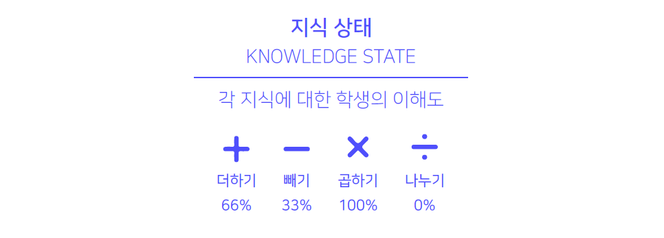
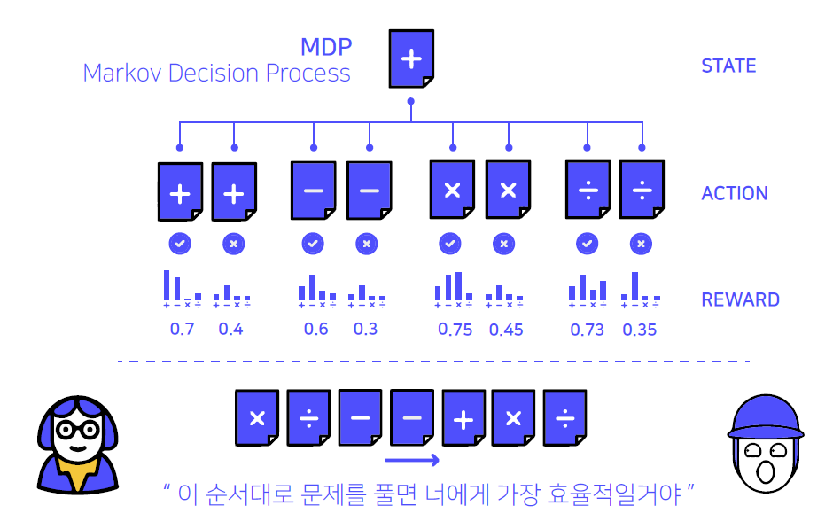
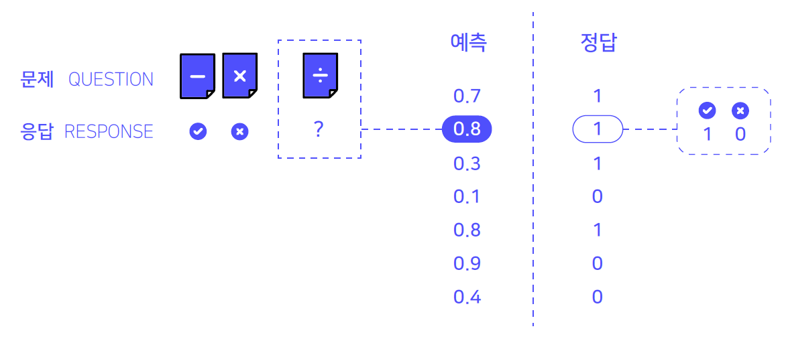
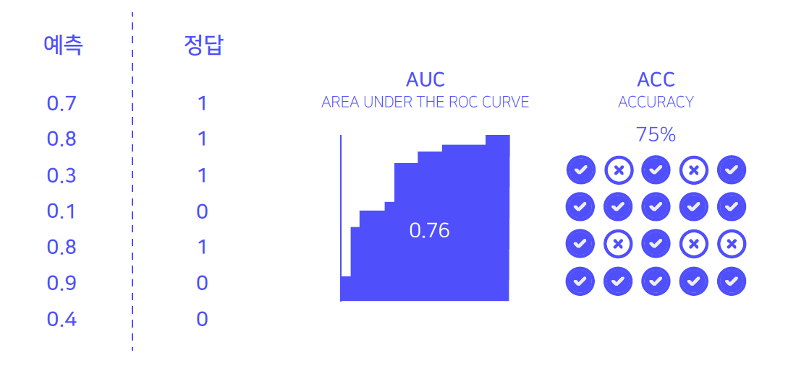
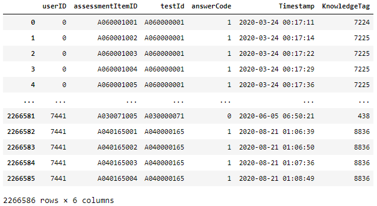
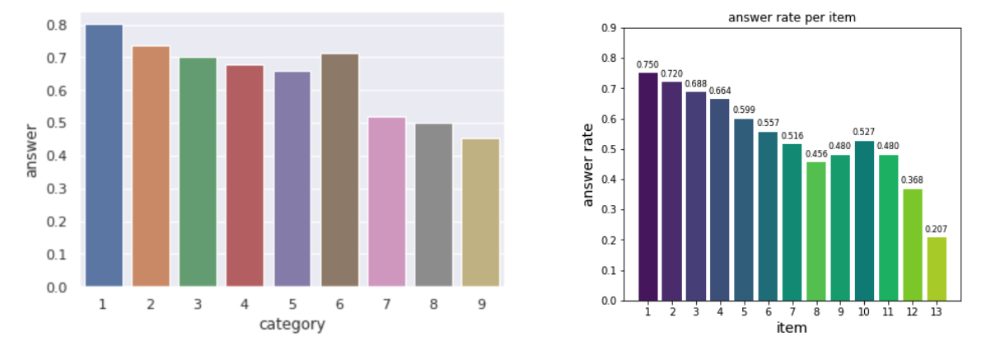
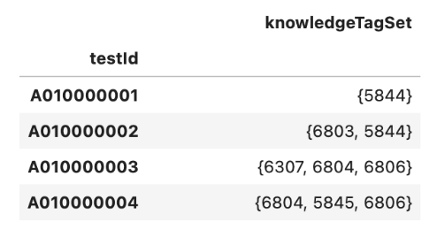
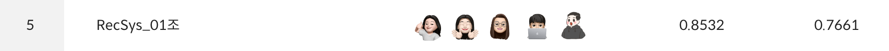

# Deep Knowledge Tracing (DKT)

## 팀원 소개

|                                                  [김동현](https://github.com/donghyyun)                                                   |                                                                          [임지원](https://github.com/sophi1127)                                                                           |                                                 [이수연](https://github.com/coding-groot)                                                  |                                                                        [진상우](https://github.com/Jin-s-work)                                                                         |                                                                         [심재정](https://github.com/Jaejeong98)                                                                         |
| :-------------------------------------------------------------------------------------------------------: | :-------------------------------------------------------------------------------------------------------------------------------------------------------: | :-----------------------------------------------------------------------------------------------------: | :---------------------------------------------------------------------------------------------------------------------------------------------------: | :----------------------------------------------------------------------------------------------------------------------------------------------------: |
| | | | | |

 

## Contribution

+ [`김동현`](https://github.com/donghyyun) &nbsp; EDA • Feature Engineering • CatBoost

+ [`임지원`](https://github.com/sophi1127) &nbsp; EDA • Feature Engineering • LightGBM • SAKT • Ensemble • wandb

+ [`이수연`](https://github.com/coding-groot) &nbsp; EDA • LightGCN • Ensemble

+ [`진상우`](https://github.com/Jin-s-work) &nbsp; LightGCN • wandb

+ [`심재정`](https://github.com/Jaejeong98) &nbsp; LSTM • LSTM Attention • Last query • wandb

 

## DKT란?
DKT는 Deep Knowledge Tracing의 약자로 우리의 "지식 상태"를 추적하는 딥러닝 방법론입니다.

  

DKT를 통해 단순히 시험 성적을 알려주는 것을 넘어서 해당 분야에 대해 얼마나 이해하고 있는지 측정 가능합니다. 또한 이러한 이해도를 활용하여 아직 풀지 않은 문제의 정답 여부를 예측할 수 있습니다.

  

해당 프로젝트는 Iscream 데이터셋을 활용하여 학생이 마지막으로 주어진 문제의 정답을 맞출 수 있는지 여부를 예측하는 모델을 구현하였습니다.

 

## 성능 지표

DKT는 주어진 마지막 문제를 맞았는지(1)와 틀렸는지(0) 분류하는 이진 분류 문제입니다.

  

성능 지표로 AUROC(Area Under the ROC curve)와 Accuracy를 사용하였습니다.

  

AUROC는 ROC 곡선 아래 부분의 넓이를 의미하는데, ROC는 False Positive Rate(x축)과 True Positive Rate(y축)이 이루는 곡선을 의미합니다. AUC가 1이면 모델이 0과 1을 완벽하게 분리해낼 수 있다는 것을 의미하며, 반면에 AUC가 0.5이면 모델이 클래스를 구분하지 못한다는 것을 의미합니다.

 

## 데이터

  

+ `userID` 사용자의 고유번호 : 총 7,442명의 고유 사용자가 있으며, train/test셋은 이 userID를 기준으로 90/10의 비율로 나누어졌습니다.
+ `assessmentItemID` 문항의 고유번호 : 총 9,454개의 고유 문항이 있습니다.
+ `testId` 시험지의 고유번호 : 총 1,537개의 고유한 시험지가 있습니다.
+ `answerCode` 사용자가 해당 문항을 맞췄는지 여부에 대한 이진 데이터 : 0은 사용자가 해당 문항을 틀린 것, 1은 사용자가 해당 문항을 맞춘 것입니다.
+ `Timestamp` 사용자가 해당문항을 풀기 시작한 시점의 데이터
+ `KnowledgeTag` 중분류 : 총 912개의 고유 태그가 존재합니다.

 

## EDA & Feature Engineering

1. Feature 세분화 : `assessmentItemID` ⇒ `category`, `test`, `item` 
  세분화한 변수들의 정답률을 비교하였을 때, `category`와 `item` 변수는 값에 따라 정답률의 차이를 보여 category 타입의 변수로 가공하였습니다.
  

    
  

  

2. `KnowledgeTag`를 활용한 `chapter` 변수 생성 
  `testId` 별 고유힌 `KnowledgeTag`들을 집합으로 묶었으며, 서로 다른 `testId`를 가지더라도, 두 시험지의 `KnowledgeTag` 집합 사이에 교집합이 존재한다면 두 시험지는 같은 내용을 다루는 시험지라고 판단하여 동일한 `chapter`로 분류하였습니다. 예를 들어 아래 이미지에서 `testId` ‘A010000001’와 ‘A010000002’의 KnowledgeTagSet은 각각 {5844}와 {6803, 5844} 이며, 5844라는 KnowledgeTag가 겹치므로 같은 `chapter`에 속하게 됩니다.
  

    
  

  
3. 학생의 실력 향상 관련 변수 생성 
  학습을 통해 실력이 향상될 수 있기 때문에, 학생의 실력을 시간에 따라 나타낼 수 있는 변수들을 추가하였습니다. 현재까지 학생이 푼 모든 문제에 대하여 누적 문제 개수, 누적 정답 개수, 정확도를 변수로 생성하였습니다.

4. 이전 문제를 푸는데 소요된 시간 관련 변수 생성 
  `Timestamp` 변수는 문제를 풀기 시작한 시점이므로 다음 문제의 Timestamp에서 현재 Timestamp를 빼 `prev elapsed` 변수를 생성하였습니다. test 데이터의 경우 학생이 푼 마지막 문제이므로 해당 문제를 푸는데 소요된 시간을 알 수 없기 때문에 이전 문제를 푸는데 걸린 시간의 평균(`prev elapsed mean`)을 변수로 생성하였습니다.
 
 

## 모델

### GBM 계열
DKT 태스크에서 GBM 계열의 모델의 성능이 높은 것으로 알려져있지만, Sequential한 특징을 변수로 추가해야 한다는 특징이 있습니다. 따라서 GBM 계열의 모델을 사용하기 위해서 하이퍼파라미터 튜닝 뿐만 아니라 Feature Engineering이 중요한 역할을 차지하였습니다.
1. CatBoost: Catboost는 Gradient Boosting 계열의 모델 중 한 종류이자 Yandex에 의해 개발된 오픈 소스 프레임워크입니다. 기존의 다른 모델에 비해 성능이 뛰어날 뿐 아니라, 카테고리형 변수에 대한 처리와 하이퍼 파라미터 튜닝을 모델 내부적으로 지원하여 구현하기에 편리하다는 장점이 있습니다.
2. LightGBM은: LightGBM은 Gradient Boosting 계열의 모델로 트리 기반의 학습 알고리즘입니다. XGBoost와 함께 자주 사용되지만, XGBoost에 비하여 속도가 빠르다는 장점을 가지고 있습니다.

### Sequential 계열
DKT 데이터는 학생이 최종 문제를 풀기 전까지의 모든 문제를 학습에 사용하므로 Sequential 데이터의 특징을 가집니다. 이러한 데이터의 특성을 활용하기 위해서 Sequential 계열의 모델을 사용하였습니다.
1. DKT: LSTM은 RNN의 단점인 기울기 소실 문제를 해결하기 위해 gate를 추가한 모델이며, LSTM Attention은 LSTM에 self-Attention을 추가한 모델입니다. 순서가 있는 Sequential 데이터에서 특징들을 추출하여 문제를 해결해야 했기 때문에 LSTM과 LSTM Attention을 활용하였습니다.
2. SAKT: SAKT 모델은 transformer의 attention mechanism을 활용한 모델로, Input → Embedding Layer → Attention Layer → Feed-Forward Layer → Prediction Layer → Output의 과정을 거쳐서 계산됩니다.
3. Last query: Last query 모델은 Kaggle Riiid AIEd Challenge 2020의 1st place solution입니다. transformer encoder → LSTM → DNN → Output의 과정을 거쳤으며, transformer encoder의 입력으로 sequence의 마지막 query만 사용하여 시간복잡도를 $O(n^2)$에서 $O(n)$으로 줄인 모델입니다.

### Graph 계열
Graph 모델은 Dependence Structure를 모델링할 수 있다는 특징으로 인해 DKT에서는 불가능했던 학습 개념 간 관계를 그래프 형식으로 해석 가능하다는 장점이 있습니다.
- LightGCN: GCN 모델은 CNN에서의 Convolution 개념을 GNN에 적용한 것으로 LightGCN 모델은 GCN의 가장 핵심적인 부분만 사용한 더 정확하고 가벼운 추천 모델입니다.

### Ensemble
1. 서로 다른 계열의 모델을 앙상블하기 위해 CatBoost, LightGBM, SAKT, Last query, LightGCN 모델의 결과를 활용해서 Hard Voting 한 뒤, 해당 결과를 예측한 모델들 predict 값의 평균을 구하였습니다. 예를 들어 CatBoost, LightGBM, LightGCN 모델이 1로 예측하였고 SAKT, Last query 모델이 0으로 예측하였다면, CatBoost, LightGBM, LightGCN 모델의 predict 값을 평균하여 최종 결과값으로 제시하였습니다.
2. 단일 모델로 가장 성능이 높았던 CatBoost와 LightGBM 모델을 사용하여 앙상블하였습니다. Validation 데이터셋의 결과값을 기준으로 모델을 비교하였을 때 LightGBM:CatBoost = 2:8로 앙상블하였을 때 가장 높은 성능을 보였기 때문에 LightGBM과 CatBoost 모델의 predict 값을 20%와 80%씩 더해 최종 결과값으로 제시하였습니다.

 

## 결과 및 평가

  

  

Ensemble 중 두 번째 방법으로 최종 결과값을 제출한 결과 AUROC 값은 0.8532, Accuracy 값은 0.7661을 기록하였습니다. 실제로 제출하지는 않았지만 가장 높은 성능을 기록한 모델은 54개의 변수를 사용한 LightGBM 모델로 AUROC 값은 0.8559, Accuracy 값은 0.7715을 기록하였습니다. 해당 데이터셋의 경우 Sequential 특징을 반영한 GBM 계열의 모델이 우수한 성능을 보이는 것으로 나타났습니다.

